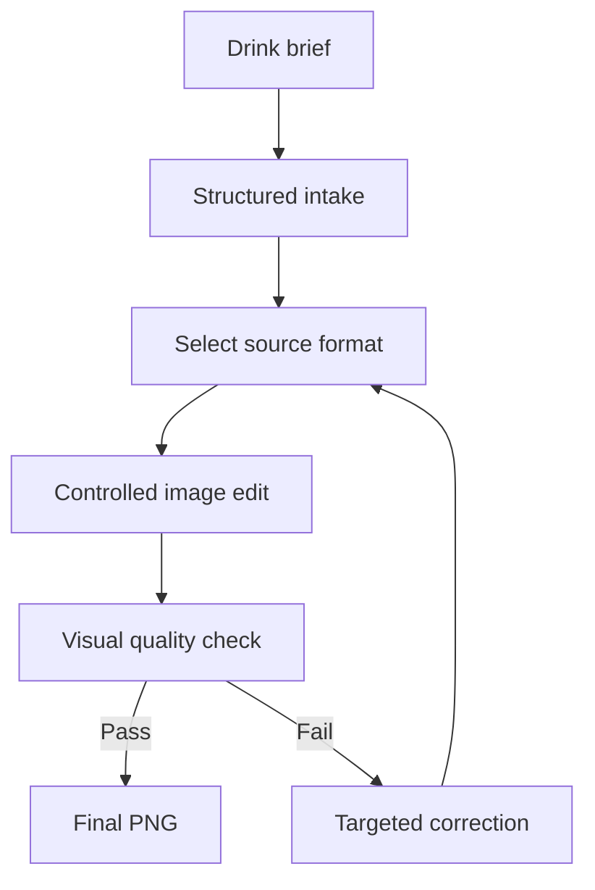

# Cafe Picture Generator

An agent workflow for creating consistent commercial pictures of fresh café beverages from approved source photographs.

**[Try the live single-picture demo](https://vedantm1049.github.io/brand-consistent-photo-studio/)**

The browser demo accepts one beverage brief, supports all five formats, and produces the controlled image-editing prompt and quality-control checklist. It does not call a paid image model or expose an API key in the browser. Actual image creation runs through the skill in a compatible agent environment.

It supports hot drinks, iced drinks, frappes and milkshakes, protein drinks, and slushies. The system treats every request as a controlled edit. The vessel, camera, lighting, background, crop, and shadows stay fixed while the drink and approved ingredient props change.

## Why this exists

Traditional menu photography is slow to repeat when a café launches many SKUs. Uncontrolled image generation is faster, but it often changes the glass, angle, reflections, scale, or composition.

Cafe Picture Generator adds a production layer between the product brief and the image model:

- structured intake for incomplete briefs;
- a locked source photograph for each drink format;
- precise control of drink appearance, toppings, and external garnishes;
- batch input through CSV;
- pre-generation validation;
- visual quality checks and targeted correction;
- predictable filenames and clean final-output folders.

## Supported formats

| Format | Typical products | Important visual cues |
| --- | --- | --- |
| Hot | Coffee, tea, chocolate | Steam, crema, microfoam, ceramic vessel |
| Iced | Iced coffee, matcha, lemonade | Clear ice, condensation, liquid layers |
| Frappe | Frappes, milkshakes | Viscosity, blended texture, whipped topping |
| Protein | Protein shakes and functional drinks | Natural thickness, powder integration, restrained foam |
| Slush | Slushies and frozen coolers | Fine ice crystals, translucency, colour gradients |

## Workflow



## Repository contents

```text
SKILL.md                         Agent workflow
agents/openai.yaml               Skill interface metadata
references/production-spec.md   Image-editing and QA contract
references/sheet-schema.md      Batch CSV specification
assets/cafe-sku-template.csv    Example five-format batch
scripts/validate_sheet.py       Deterministic CSV validator
tests/test_validate_sheet.py    Validator tests
examples/sample-briefs.md       Single-SKU brief examples
```

## Quick start

1. Clone this repository.
2. Add one approved, rights-cleared source photograph for each format you plan to use:

```text
assets/source-hot.png
assets/source-iced.png
assets/source-frappe.png
assets/source-protein.png
assets/source-slush.png
```

3. Validate the example batch:

```bash
python scripts/validate_sheet.py assets/cafe-sku-template.csv
```

4. Install or load the repository as an agent skill in an environment with image-editing capability.
5. Ask it to create one beverage from a name and description, or provide a CSV that follows the batch schema.

## Example request

```text
Create an Iced Mango Matcha Latte.
It should have a distinct mango base, milk in the middle, and matcha on top.
Place mango slices on the left and a small glass bowl of matcha powder on the right.
```

For an incomplete request, the agent collects only the visible decisions needed for the photograph. It does not interrogate the user about the recipe, sweetness, or ingredients that cannot be seen.

## One picture or a full menu

- **One picture:** provide a drink name and description. The skill collects any missing visible decisions and generates one final PNG.
- **Full menu:** provide a validated CSV. Each row starts independently from the original source asset for its format.

## Batch use

The validator checks required fields, supported formats, duplicate SKU names, output filenames, and garnish conflicts.

```bash
python scripts/validate_sheet.py menu.csv
python scripts/validate_sheet.py menu.csv --write-normalized normalized-menu.csv
```

Blank garnish cells normalize to `none`. If `output_filename` is blank, the validator derives a lowercase kebab-case PNG name from `sku_name`.

## Design principles

- Start every SKU from its original approved source photograph.
- Never use one generated SKU as the source for another.
- Change only the beverage, requested top treatment, and approved external garnishes.
- Reject visual drift instead of accepting a merely attractive result.
- Correct failed images from the original source to avoid compounding errors.
- Keep final folders free of failed and superseded generations.

## Project boundary

This public repository is a brand-neutral implementation. It does not contain employer-owned photographs, logos, menus, sales data, or internal operating documents. Users must provide source images that they own or have permission to use.
