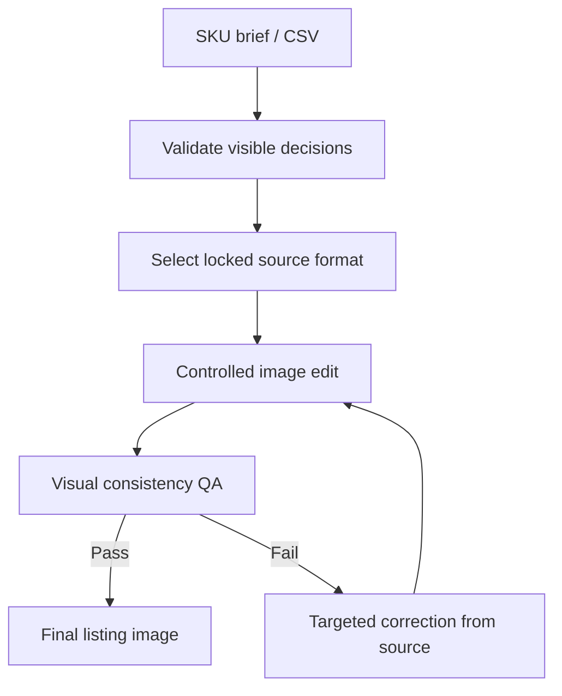

# Brand-Consistent Photo Studio

Generate brand-consistent F&B listing photography across an entire beverage menu without reshooting every SKU.

![One approved iced-drink source photo transformed into multiple brand-consistent beverage SKUs while keeping vessel, camera, lighting, crop and background fixed.] 

**[Try the live production-brief demo](https://vedantm1049.github.io/brand-consistent-photo-studio/)**

**One approved source photograph. Multiple SKUs. The drink changes; the visual system does not.**

The Studio treats image generation as a controlled edit: vessel, camera, lighting, background, framing, crop and shadows stay locked while the beverage and approved ingredient props change.

> **Public demo boundary:** the browser demo builds the controlled production brief and fixed QA contract. It does not expose a paid image-model key in the browser. Actual image editing runs through the repository skill in an image-capable agent environment using rights-cleared source photographs.

## What the hero example shows

The hero GIF starts with one approved **Iced Spanish Latte** source photograph and uses that same iced-format visual system to create four distinct SKUs:

- Mango Matcha Latte
- Strawberry Matcha Latte
- Hibiscus Watermelon Iced Tea
- Iced Mocha

Every variant starts from the same approved source image rather than from a previous generation. The glass, camera angle, framing, crop, background, lighting and shadows are intended to remain fixed while only the beverage and supporting ingredient props change.

That is the core product idea: **scale a visual identity across a menu without letting AI generation slowly redesign the photograph.**

## The problem

A café can photograph one SKU beautifully and still struggle to scale that visual identity across 20, 40 or 100 menu items. Traditional reshoots are slow and expensive. Uncontrolled image generation is fast, but often changes the glass, camera angle, crop, reflections, lighting or scale from one SKU to the next.

Brand-Consistent Photo Studio treats generation as a **controlled image-editing system**, not a fresh composition task.

It adds a production layer between the product brief and the image model:

- one locked source photograph per beverage format;
- structured intake focused only on visible product decisions;
- explicit controls for drink appearance, toppings and external props;
- deterministic CSV validation for full-menu batches;
- a visual QA contract that rejects brand drift;
- targeted correction from the original source rather than from failed generations;
- predictable filenames and clean final-output folders.

## One source photo → an entire menu

For every SKU, the system preserves:

**Locked:** vessel · position · camera angle · framing · white space · background · lighting · reflections · shadows · crop

**Allowed to change:** beverage · ice/layers/foam/viscosity · top treatment · approved ingredient props

Each generated SKU starts again from the original approved source photograph. Generated outputs never become templates for the next SKU, preventing visual drift from compounding across a menu.

## Supported formats

| Format | Typical products | Visual controls |
| --- | --- | --- |
| Hot | Coffee, tea, chocolate | Steam, crema, microfoam, ceramic vessel |
| Iced | Iced coffee, matcha, lemonade | Clear ice, condensation, liquid layers |
| Frappe | Frappes, milkshakes | Viscosity, blended texture, whipped topping |
| Protein | Protein shakes, functional drinks | Natural thickness, powder integration, restrained foam |
| Slush | Slushies, frozen coolers | Fine ice crystals, translucency, colour gradients |

## Production workflow



The QA layer checks whether the result is not merely attractive, but **consistent with the approved visual system**: vessel, angle, scale, crop, lighting, shadows, drink physics and prop placement.

## Browser demo vs production workflow

The public GitHub Pages demo intentionally stops before paid image generation.

**Browser demo**
- choose one of five drink formats;
- describe the visible beverage and props;
- generate the exact controlled-edit instruction;
- inspect the fixed QA checklist;
- export the structured brief as JSON.

**Agent workflow**
- takes a rights-cleared source photograph;
- performs the controlled image edit;
- evaluates the result against the production specification;
- rejects visual drift;
- corrects failed outputs from the original source;
- supports both one-off images and validated full-menu batches.

## Example request

```text
Create an Iced Mango Matcha Latte.
Show a distinct mango base, milk in the middle and matcha on top.
Place ripe mango slices on the left and a small clear bowl of matcha powder on the right.
Keep the source glass, camera, lighting, framing and background unchanged.
```

For incomplete requests, the workflow asks only for decisions that can actually be seen in the final photograph. It does not ask about sweetness, recipes or invisible ingredients.

## Batch use

A full menu can be supplied as CSV. The validator checks required fields, supported formats, duplicate SKU names, output filenames and garnish conflicts before generation begins.

```bash
python scripts/validate_sheet.py assets/cafe-sku-template.csv
python scripts/validate_sheet.py menu.csv --write-normalized normalized-menu.csv
```

Blank garnish cells normalize to `none`. If `output_filename` is blank, the validator derives a lowercase kebab-case PNG filename from `sku_name`.

## Repository structure

```text
SKILL.md                         Agent workflow
agents/openai.yaml               Skill interface metadata
references/production-spec.md   Image-editing and visual-QA contract
references/sheet-schema.md      Batch CSV specification
assets/cafe-sku-template.csv    Example five-format batch
scripts/validate_sheet.py       Deterministic CSV validator
tests/test_validate_sheet.py    Validator tests
examples/sample-briefs.md       Single-SKU brief examples
docs/                            Live browser demo
```

## Quick start

1. Clone the repository.
2. Add one approved, rights-cleared source photograph for each format you plan to use:

```text
assets/source-hot.png
assets/source-iced.png
assets/source-frappe.png
assets/source-protein.png
assets/source-slush.png
```

3. Validate your brief or batch.
4. Load the repository as an agent skill in an environment with image-editing capability.
5. Generate one SKU or run a full validated menu batch.

## Design principles

- Start every SKU from its original approved source photograph.
- Never chain one generated SKU into the next.
- Change only the beverage, top treatment and approved external props.
- Reject visual drift rather than accepting a merely attractive result.
- Correct failed images from the original source to avoid compounding errors.
- Keep production outputs deterministic, inspectable and easy to hand off.

## Project boundary

This public repository is a brand-neutral implementation. It contains no employer-owned photographs, logos, menus, sales data or internal operating documents. Users must provide source images that they own or have permission to use.
